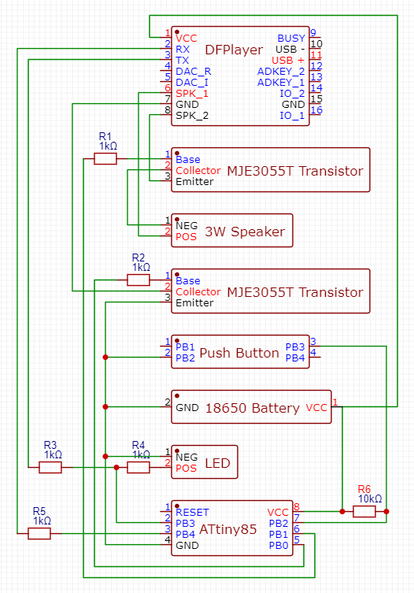
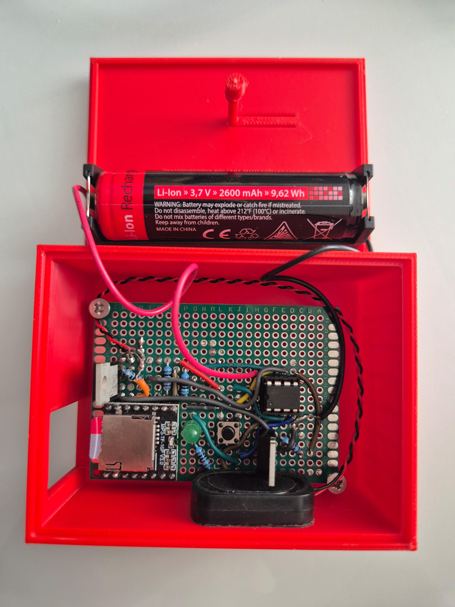

# Zombie
A low power, standalone device that can play soundtracks to your specifications. See the branches for use cases!

## Description
The developed device can play any soundtracks, spaced over large periods of time. It is compact, runs on a single battery and is low power, using only 3μA in deepsleep! It has a button for input, and an LED for feedback!

## Getting started
[Learn how to upload code to an ATtiny85.](https://www.youtube.com/watch?v=sycSdI49hlY)

### Hardware components list
| Component              | Estimated Cost | Notes                              |
|------------------------|----------------|------------------------------------|
| ATtiny85               | €2.53          |                                    |
| 8-pin IC socket        | €0.18          | Only for post-assembly code upload |
| DFPayer mini           | €1.45          |                                    |
| SD card                | €5.91          | 32GB is common, but overkill       |
| 18650 battery          | €2.63          | Rechargeable                       |
| battery holder         | €0.34          |                                    |
| small 3W 4Ω speaker    | €1.13          |                                    |
| 2x MJE3055T transistor | €0.20          |                                    |
| 4pin push button       | €0             |                                    |
| LED Diode              | €0             |                                    |
| 10kΩ resistor          | €0             |                                    |
| 4x 1kΩ resistor        | €0             |                                    |
| 10μF capacitor         | €0             | Only for uploading code            |
| TP4046 charger         | €0.21          | Only for recharging the battery    |
| 5x7cm universal PCB    | €0.66          | Optional, but recommended          |
| Total                  | €15.14         |                                    |

### Hardware schematic

### Software
This is a [PlatformIO project in VSCode](https://docs.platformio.org/en/stable/integration/ide/vscode.html). Create a new PlatformIO project, and replace all files and folders with this repository.
Build and upload the code. The first time building can take a while.

### Sound tracks
Copy the "01" folder in "/audio/" to the SD card.

### Software navigation
With the first button push, you enter the menu. The number of button pushes in the next 6 seconds decides which action is performed.

## Notes
- [DFPlayer documentation](https://wiki.dfrobot.com/DFPlayer_Mini_SKU_DFR0299#Connection_Diagram).
- Both .wav and .mp3 work.
- For reading the log output, use /test_scripts/forwarder.cpp.
- To test commands for the DFPlayer, use /test_scripts/direct_test.cpp

## Final result

## Acknowledgements
- [External interrupt](https://web.archive.org/web/20240123141250/https://www.gadgetronicx.com/attiny85-external-pin-change-interrupt/)
